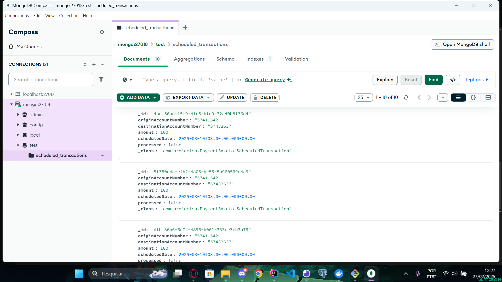

# ProducerSA - Backend

## Descrição do Projeto
Desenvolvi uma API com Java e Spring, essa API é responsável por produzir mensagens de transferências bancárias para minha fila transaction_queue do RabbitMQ, ela envia mensagens em formato Json para a queue, as mensage são produzidas em formato HTTP e enviadas para a queue. O projeto conta com um banco de dados NoSQL, utilizei o MongoDB, ele é responsável por armazenar as mensagens das solicitações que são feitas ao decorrer do dia, para que a API publique todas as mensagens em um certo horário definido. Todo sistema está em um contêiner no Docker.

- Intalção do projeto no docker-compose, com o seguinte comando no terminal bash: **docker-compose up -d --build**


## Tecnologias Utilizadas
- **Java**: 17.
- **Spring Boot**: Framework utilizado.
- **Banco de Dados**: MongoDB.
- **Ferramentas**: Maven, Docker Compose, RabbitMQ, Swagger, Scheduled.
- **JUnit/Mockito**: Testes unitários.
- **Docker**: Docker Compose.

## Funcionalidades

- Operação de transferência entre contas cadastradas
- Registro de operações no banco de dados
- Sistema de mensageria
- Queue de operações
- Agendamento de tarefas

## Modelo de teste Json

- Esse modelo pode ser usado tanto para requisições HTTP, quanto no RabbitMQ:
```json
{
  "originAccountNumber": "57411542",
  "destinationAccountNumber": "57432637",
  "amount": 200.0
}
```


**Imagens**


  
  
  
  
  


